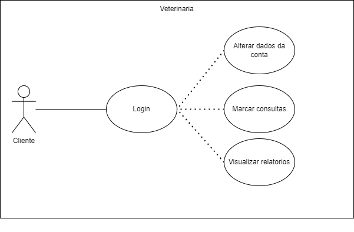

# Projeto Integrador Mobile - Veterinaria Grande Orvalho- Modelo

A seguir está um modelo de documentação para estudos relacionados à criação de um aplicativo de front-end e back-end para uma clínica veterinária. Este sistema foi apresentado e desenvolvido por estudantes do Ensino Médio integrado ao curso técnico em Informática para a Internet do IFC - Campus Araquari.

Equipe:
- [Miguel Bochi](github.com/MiguelBochi)
- [Aluno2](github.com/aluno2)
  
Links do projeto:
-   [Documentação (esse documento)](github.com/marcoandre/pi-modelo)
-   Backend: [Repositório](github.com/marcoandre/pi-backend) e [Publicação](https://pi-backend.herokuapp.com/)
-   Frontend[Repositório](github.com/marcoandre/pi-frontend) e [Publicação](https://pi-frontend.herokuapp.com/)

# 2. Situação Problema
A Clínica Veterinária Grande Orvalho opera de maneira simples e eficiente, contando com uma equipe composta por dois funcionários: o médico veterinário e gerente, Baltazar, e sua secretária e recepcionista, chamada Nã. Nã desempenha um papel fundamental no agendamento de consultas, criação de fichas para os clientes e seus animais de estimação, além de cuidar da organização dos documentos. Enquanto isso, Baltazar é responsável pelo cuidado direto dos animais e também lida com as questões jurídicas relacionadas à clínica veterinária. Essa divisão de tarefas permite que a Clínica Veterinária Grande Orvalho ofereça serviços de alta qualidade e atendimento personalizado aos seus clientes e seus adoráveis companheiros de quatro patas.

O ciclo de consultas na clínica veterinária segue o seguinte processo: a recepcionista, Nã, inicia criando uma ficha para o cliente e seu animal de estimação. Durante esse processo, ela também solicita relatórios médicos anteriores do animal. Caso esses detalhes não estejam disponíveis ou faltem informações, é agendada uma vistoria ao animal. O pagamento da vistoria é realizado no mesmo momento.

Durante a vistoria, o médico veterinário, Baltazar, avalia o animal e atualiza sua ficha com o estado atual, além de criar um relatório correspondente. Se for identificada a necessidade de um tratamento especial, é feita uma análise do custo necessário para o tratamento. Esse custo é então informado ao cliente. O pagamento pode ser realizado integralmente ou de forma parcelada. O tratamento é iniciado no mesmo mês do pagamento da primeira parcela, e o animal é liberado após o período de tratamento. Durante esse período, é criado outro relatório abrangendo o acompanhamento e os resultados do tratamento.

Essa abordagem garante que a clínica veterinária ofereça um serviço completo, desde o agendamento inicial até o tratamento e o acompanhamento necessário para os animais de estimação. A colaboração entre Nã e Baltazar assegura uma operação eficiente e um atendimento de qualidade aos clientes da Clínica Veterinária Grande Orvalho.

# 3. Descrição da proposta

- A aplicação desenvolvida servirá como uma ferramenta de uso majoritário pelos clientes da clínica veterinária. Os clientes poderão agendar consultas com facilidade e ter acesso aos relatórios completos de seus animais, bem como uma ficha atualizada com o status de saúde e histórico médico.Além disso, o sistema contará com recursos adicionais para melhorar a experiência dos clientes. Será incluído um calendário integrado que permitirá a visualização das datas e horários disponíveis para agendamento de consultas. Dessa forma, os clientes poderão escolher o horário mais conveniente para eles e seus animais de estimação.Outro recurso importante será um sistema de notificação que enviará lembretes automáticos aos clientes sobre as consultas agendadas. Isso ajudará a evitar esquecimentos e garantir que os clientes estejam cientes dos horários marcados.Além disso, para os animais que estão em tratamento domiciliar e precisam tomar medicação regularmente, o sistema fornecerá um sistema de lembretes de horário. Os clientes receberão alertas no aplicativo, informando-os sobre o momento exato em que o animal precisa tomar a medicação. Isso garantirá que o tratamento seja seguido corretamente, mesmo fora da clínica. Esses recursos adicionais visam oferecer comodidade e praticidade aos clientes, proporcionando uma experiência completa e facilitando o cuidado com seus animais de estimação. Através desse sistema, a clínica veterinária busca melhorar o relacionamento com os clientes, além de fornecer um serviço de qualidade e atendimento personalizado.

# 4. Regras de negócio

 **RN01 – Cadastro e Login na conta**:
- Para acessar a conta, o usuário deve ter realizado previamente o cadastro no sistema.
- O login pode ser realizado com o e-mail ou nome de usuário fornecido durante o cadastro.

**RN02 – Marcar consulta**:
- Para marcar uma consulta, o usuário deve ter um animal previamente cadastrado no sistema.
- A marcação da consulta está sujeita à disponibilidade de horários no sistema.
- Além disso, o sistema deve verificar a disponibilidade do profissional de saúde ou médico.

**RN03 – Visualização de relatório:**
- O usuário poderá visualizar os relatórios relacionados aos animais cadastrados na sua conta.
- Será necessário que existam relatórios previamente cadastrados para o animal em questão.

**RN04 – Alteração de senha:**
- O usuário pode solicitar a alteração de senha.
Para a alteração, o sistema enviará uma senha de acesso temporária para o e-mail registrado pelo usuário.
- Após o login com a senha temporária, o usuário deverá criar uma nova senha definitiva.

**RN05 – Notificação de consulta:**
- O sistema poderá enviar notificações sobre consultas e outros eventos relevantes para o usuário.
- O usuário deve habilitar essa opção nas configurações da conta para receber as notificações.
- As notificações podem incluir lembretes de consultas, resultados de exames, entre outros.

# 5. Requisitos funcionais
**Entradas:**
**RF01 - Alteração de foto:**
- O sistema permitirá que o usuário envie e atualize imagens no servidor para alterar sua foto de perfil e a foto dos seus animais.
- Dados necessários: Arquivo de imagem no formato arquivo.jpg.
- Usuários: Todos os níveis de usuário.

**RF02 - Agendamento de consultas:**
- O sistema deve permitir que o cliente registre consultas no sistema.
- Dados necessários: Data da consulta e login do dono do animal.
- Usuários: Cliente.

**RF03 - Lembrete:**
- O sistema deve permitir que o cliente habilite ou desabilite o recebimento de lembretes do sistema.
- Dados necessários: Não especificado. (Podem ser informações como tipo de lembrete, data/horário dos lembretes etc.)
- Usuários: Cliente.

**RF04 - Mudança de senha:**
- O sistema deve permitir que todos os níveis de usuário alterem suas senhas de acesso usando um código fornecido pelo sistema.
- Dados necessários: Código (senha), login, senha nova.
- Usuários: Todos os níveis de usuário.

**Processamento:**
**RF05 - Cálculo do código de senha:**
- O sistema deve calcular e verificar o código para a mudança de senha.
- Dados necessários: Código (senha), login.
- Usuários: Sistema.

**RF06 - Criação de consulta:**
- O sistema deve calcular as datas das consultas e avaliar se a data é válida ou não para a consulta.
- Dados necessários: Data da consulta, data atual.
- Usuários: Sistema.

**RF07 - Alarmes dos lembretes:**
- O sistema deve calcular os lembretes ativados e enviar notificações de lembrete.
- Dados necessários: Informações dos lembretes ativados, data dos lembretes.
- Usuários: Sistema.

**Saídas:** **RF08 - Fichas dos animais:**
-  O sistema deve apresentar uma ficha com detalhes sobre os animais do cliente, incluindo relatórios.
- Dados necessários: Ficha do animal, relatórios, login do dono.
- Usuários: Cliente.

**RF09 - Acesso a relatórios:**
- O sistema deve permitir que o cliente acesse relatórios antigos e recentes sobre seus animais ao entrar em suas fichas.
- Dados necessários: Login do dono, relatórios.
- Usuários: Cliente.

# 6. Requisitos não funcionais
**R.N.F. 01**
 - Sistemas homologados: Antes de ser lançado, o sistema deve passar por um processo de homologação para garantir que funcione corretamente e seja compatível com dispositivos Android e iOS.

**R.N.F. 02**
 - Tecnologia Front-end: O software utilizará CSS3, HTML5 e o framework React Native para proporcionar uma interface de usuário moderna e responsiva, adaptada para dispositivos móveis.

**R.N.F. 03** 
- Tecnologia Back-end: O software será desenvolvido utilizando a linguagem de programação Python. O back-end será implementado com o framework Django, conhecido por sua eficiência e segurança, e a API REST será construída usando o Django REST Framework para facilitar a comunicação entre o front-end e o back-end.

**R.N.F. 04**
 - Controle de horários: Será implementado um mecanismo robusto para evitar conflitos de horários e garantir que não seja possível marcar duas consultas para o mesmo horário.

**R.N.F. 05** 
- Lembrete de consulta: O sistema contará com um recurso de lembrete de consultas para notificar os usuários sobre seus compromissos agendados, ajudando a reduzir a ocorrência de atrasos e ausências.

**R.N.F. 06**
 - Autenticação: O acesso ao sistema exigirá autenticação. Os usuários poderão criar contas de acesso com credenciais específicas ou solicitar uma redefinição de senha, caso necessário. A autenticação será cuidadosamente gerenciada para garantir a segurança do sistema.

**R.N.F. 02**
 - Controle de acesso e privilégios: O software implementará diferentes níveis de acesso com base nos perfis de usuário. Administradores terão acesso completo ao sistema, enquanto usuários comuns terão permissões restritas, limitadas às funcionalidades pertinentes às suas responsabilidades. Isso garantirá a confidencialidade e integridade dos dados, evitando o acesso não autorizado a informações sensíveis.

# 7. Diagrama de Caso de Uso

---

