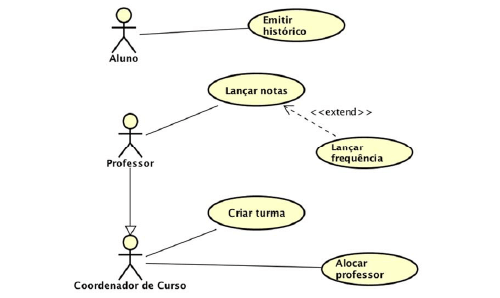
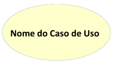
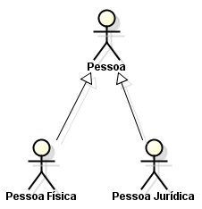

# Projeto Integrador Mobile - Veterinaria Grande Orvalho- Modelo

A seguir está um modelo de documentação para estudos relacionados à criação de um aplicativo de front-end e back-end para uma clínica veterinária. Este sistema foi apresentado e desenvolvido por estudantes do Ensino Médio integrado ao curso técnico em Informática para a Internet do IFC - Campus Araquari.

Equipe:
- [Miguel Bochi](github.com/MiguelBochi)
- [Aluno2](github.com/aluno2)
  
Links do projeto:
-   [Documentação (esse documento)](github.com/marcoandre/pi-modelo)
-   Backend: [Repositório](github.com/marcoandre/pi-backend) e [Publicação](https://pi-backend.herokuapp.com/)
-   Frontend[Repositório](github.com/marcoandre/pi-frontend) e [Publicação](https://pi-frontend.herokuapp.com/)

# 2. Situação Problema

A Clínica Veterinária Grande Orvalho opera de maneira simples e eficiente, contando com uma equipe composta por dois funcionários: o médico veterinário e gerente, Baltazar, e sua secretária e recepcionista, chamada Nã. Nã desempenha um papel fundamental no agendamento de consultas, criação de fichas para os clientes e seus animais de estimação, além de cuidar da organização dos documentos. Enquanto isso, Baltazar é responsável pelo cuidado direto dos animais e também lida com as questões jurídicas relacionadas à clínica veterinária. Essa divisão de tarefas permite que a Clínica Veterinária Grande Orvalho ofereça serviços de alta qualidade e atendimento personalizado aos seus clientes e seus adoráveis companheiros de quatro patas.

O ciclo de consultas na clínica veterinária segue o seguinte processo: a recepcionista, Nã, inicia criando uma ficha para o cliente e seu animal de estimação. Durante esse processo, ela também solicita relatórios médicos anteriores do animal. Caso esses detalhes não estejam disponíveis ou faltem informações, é agendada uma vistoria ao animal. O pagamento da vistoria é realizado no mesmo momento.

Durante a vistoria, o médico veterinário, Baltazar, avalia o animal e atualiza sua ficha com o estado atual, além de criar um relatório correspondente. Se for identificada a necessidade de um tratamento especial, é feita uma análise do custo necessário para o tratamento. Esse custo é então informado ao cliente. O pagamento pode ser realizado integralmente ou de forma parcelada. O tratamento é iniciado no mesmo mês do pagamento da primeira parcela, e o animal é liberado após o período de tratamento. Durante esse período, é criado outro relatório abrangendo o acompanhamento e os resultados do tratamento.

Essa abordagem garante que a clínica veterinária ofereça um serviço completo, desde o agendamento inicial até o tratamento e o acompanhamento necessário para os animais de estimação. A colaboração entre Nã e Baltazar assegura uma operação eficiente e um atendimento de qualidade aos clientes da Clínica Veterinária Grande Orvalho.

# 3. Descrição da proposta

- A aplicação desenvolvida servirá como uma ferramenta de uso majoritário pelos clientes da clínica veterinária. Os clientes poderão agendar consultas com facilidade e ter acesso aos relatórios completos de seus animais, bem como uma ficha atualizada com o status de saúde e histórico médico.Além disso, o sistema contará com recursos adicionais para melhorar a experiência dos clientes. Será incluído um calendário integrado que permitirá a visualização das datas e horários disponíveis para agendamento de consultas. Dessa forma, os clientes poderão escolher o horário mais conveniente para eles e seus animais de estimação.Outro recurso importante será um sistema de notificação que enviará lembretes automáticos aos clientes sobre as consultas agendadas. Isso ajudará a evitar esquecimentos e garantir que os clientes estejam cientes dos horários marcados.Além disso, para os animais que estão em tratamento domiciliar e precisam tomar medicação regularmente, o sistema fornecerá um sistema de lembretes de horário. Os clientes receberão alertas no aplicativo, informando-os sobre o momento exato em que o animal precisa tomar a medicação. Isso garantirá que o tratamento seja seguido corretamente, mesmo fora da clínica. Esses recursos adicionais visam oferecer comodidade e praticidade aos clientes, proporcionando uma experiência completa e facilitando o cuidado com seus animais de estimação. Através desse sistema, a clínica veterinária busca melhorar o relacionamento com os clientes, além de fornecer um serviço de qualidade e atendimento personalizado.

# 4. Regras de negócio

 **RN01 – Cadastro e Login na conta**:
- Para acessar a conta, o usuário deve ter realizado previamente o cadastro no sistema.
- O login pode ser realizado com o e-mail ou nome de usuário fornecido durante o cadastro.

**RN02 – Marcar consulta**:
- Para marcar uma consulta, o usuário deve ter um animal previamente cadastrado no sistema.
- A marcação da consulta está sujeita à disponibilidade de horários no sistema.
- Além disso, o sistema deve verificar a disponibilidade do profissional de saúde ou médico.

**RN03 – Visualização de relatório:**
- O usuário poderá visualizar os relatórios relacionados aos animais cadastrados na sua conta.
- Será necessário que existam relatórios previamente cadastrados para o animal em questão.

**RN04 – Alteração de senha:**
- O usuário pode solicitar a alteração de senha.
Para a alteração, o sistema enviará uma senha de acesso temporária para o e-mail registrado pelo usuário.
- Após o login com a senha temporária, o usuário deverá criar uma nova senha definitiva.

**RN05 – Notificação de consulta:**
- O sistema poderá enviar notificações sobre consultas e outros eventos relevantes para o usuário.
- O usuário deve habilitar essa opção nas configurações da conta para receber as notificações.
- As notificações podem incluir lembretes de consultas, resultados de exames, entre outros.

# 5. Requisitos funcionais
**Entradas:**
**RF01 - Alteração de foto:**
- O sistema permitirá que o usuário envie e atualize imagens no servidor para alterar sua foto de perfil e a foto dos seus animais.
- Dados necessários: Arquivo de imagem no formato arquivo.jpg.
- Usuários: Todos os níveis de usuário.

**RF02 - Agendamento de consultas:**
- O sistema deve permitir que o cliente registre consultas no sistema.
- Dados necessários: Data da consulta e login do dono do animal.
- Usuários: Cliente.

**RF03 - Lembrete:**
- O sistema deve permitir que o cliente habilite ou desabilite o recebimento de lembretes do sistema.
- Dados necessários: Não especificado. (Podem ser informações como tipo de lembrete, data/horário dos lembretes etc.)
- Usuários: Cliente.

**RF04 - Mudança de senha:**
- O sistema deve permitir que todos os níveis de usuário alterem suas senhas de acesso usando um código fornecido pelo sistema.
- Dados necessários: Código (senha), login, senha nova.
- Usuários: Todos os níveis de usuário.

**Processamento:**
**RF05 - Cálculo do código de senha:**
- O sistema deve calcular e verificar o código para a mudança de senha.
- Dados necessários: Código (senha), login.
- Usuários: Sistema.

**RF06 - Criação de consulta:**
- O sistema deve calcular as datas das consultas e avaliar se a data é válida ou não para a consulta.
- Dados necessários: Data da consulta, data atual.
- Usuários: Sistema.

**RF07 - Alarmes dos lembretes:**
- O sistema deve calcular os lembretes ativados e enviar notificações de lembrete.
- Dados necessários: Informações dos lembretes ativados, data dos lembretes.
- Usuários: Sistema.

**Saídas:** **RF08 - Fichas dos animais:**
-  O sistema deve apresentar uma ficha com detalhes sobre os animais do cliente, incluindo relatórios.
- Dados necessários: Ficha do animal, relatórios, login do dono.
- Usuários: Cliente.

**RF09 - Acesso a relatórios:**
- O sistema deve permitir que o cliente acesse relatórios antigos e recentes sobre seus animais ao entrar em suas fichas.
- Dados necessários: Login do dono, relatórios.
- Usuários: Cliente.

# 6. Requisitos não funcionais

Requisitos não funcionais (**RNFs**) são as restrições impostas a um sistema que definem seus atributos de qualidade.

Eles geralmente são indicados por adjetivos como **segurança**, **desempenho** e **escalabilidade**.

**6.1 Categorias de requisitos não funcionais**

Os requisitos não funcionais são importantes porque ajudam a garantir que o sistema atenda às necessidades do usuário.

Os Requisitos Não Funcionais explicam as limitações e restrições do sistema a ser projetado. **Esses requisitos não têm nenhum
impacto na funcionalidade do aplicativo.** Além disso, existe uma prática comum de subclassificar os requisitos não funcionais em várias categorias:

- Interface de Usuário
- Confiabilidade
- Segurança
- Atuação
- Manutenção

Os requisitos não funcionais podem ser divididos em duas categorias:

1. **Atributos de qualidade:** Estas são as características do sistema que determinam sua qualidade geral. Exemplos de atributos de qualidade incluem segurança, desempenho e usabilidade.
2. **Restrições:** Estas são as limitações impostas ao sistema.
Exemplos de restrições incluem tempo, recursos e ambiente.

**6.2 Vantagens dos requisitos não funcionais**

Os requisitos não funcionais ajudam a garantir que o sistema seja:

1. Adaptado às necessidades do usuário.
2. Adequado à finalidade.
3. Escalável, seguro e confiável.
4. Fácil de usar e manter.

**6.3 Exemplos de requisitos não funcionais**

Aqui estão alguns exemplos de requisitos não funcionais:
1. **Segurança**: O sistema deve ser protegido contra acesso não
autorizado.
2. **Atuação**: O sistema deve ser capaz de lidar com o número necessário
de usuários sem qualquer degradação no desempenho.
3. **Escalabilidade**: O sistema deve ser capaz de aumentar ou diminuir
conforme necessário.
4. **Disponibilidade**: O sistema deve estar disponível quando necessário.
5. **Manutenção**: O sistema deve ser fácil de manter e atualizar.
6. **Portabilidade**: O sistema deve ser capaz de rodar em diferentes
plataformas com alterações mínimas.
7. **Confiabilidade**: O sistema deve ser confiável e atender aos requisitos
do usuário.
8. **Usabilidade**: O sistema deve ser fácil de usar e entender.
9. **Compatibilidade**: O sistema deve ser compatível com outros sistemas.
10. **Conformidade**: O sistema deve cumprir todas as leis e regulamentos
aplicáveis.

**6.4 Exemplo de organização dos requisitos não funcionais**

(_A seguir, um exemplo de organização de requisitos não funcionais._)

**Requisitos não funcionais:**

- **R.N.F. 01 - Nome do requisito não funcional:** descrição do requisito. 
- **R.N.F. 02 - Nome do requisito não funcional:** descrição do requisito.

**Exemplos de requisitos não funcionais:**

**Sistema de Padaria**:
- **R.N.F. 01 - Navegador homologado:** O sistema deverá ser homologado para os navegadores Google Chrome e Mozilla Firefox.
- **R.N.F. 02 - Processador:** É recomendado para o sistema  no mínimo um processador Intel i3, similar ou superior a geração 7100 ou AMD Ryzen 3 da geração similar ou superior ao 3100, para que o servidor funcione em sua melhor performance.
- **R.N.F. 03 - Memória RAM:** é recomendável que o sistema possua no mínimo 2GB de RAM para melhor performance.
- **R.N.F. 04 - Arquitetura:** Será utilizada a arquitetiura MVC para o desenvolvimento do sistema, com uso de uma API REST para comunicação com o banco de dados.
- **R.N.F. 05 - Banco de dados:** O sistema será implementado com o banco de dados MySQL.
- **R.N.F. 06 - Conexão com banco de dados:** Para conexão com o banco de dados, o sistema utilizará a ferramenta de MySQL Connector.
- **R.N.F. 07 - Implementação:** O sistema deverá ser desenvolvido com linguagem Python, Javascript, HTML5, CSS3 e SQL.
- **R.N.F. 08 - Segurança:** Ficará a critério do responsável do estabelecimento a segurança dos acessos ao sistema, tendo consciência das pessoas que possua permissão para acesso.
- **R.N.F. 09 - Ambiente de Desenvolvimento Integrado (IDE):** Para criação do sistema, será utilizado o editor de texto Visual Studio Code.
- **R.N.F. 10 - Disponibilidade:** O sistema irá atender 99% do tempo de uso, somente ocorreria problemas de cadastro, remoção, inserção ou alteração em casos de falta de rede ou energia.
- **R.N.F. 11 - Legais:** O sistema deve atender às exigências da LGPD (Leis Gerais da Proteção de Dados).

**Sistema de Ordem de Serviço:**
- **R.N.F. 01 - Navegadores homologados:** o sistema deverá ser homologado para os navegadores Google Chrome e Mozilla Firefox. 
- **R.N.F. 02 - Tecnologia Front-end:** Para a exibição em front-end, o software utilizará o CSS3 e o HTML5, além do framework Vue.js.
- **R.N.F. 03- Tecnologia Back-end:** O software será desenvolvido pela linguagem de programação Python, com o framework Django e a API REST com Django REST Framework.
- **R.N.F. 04 - Interoperabilidade:** O banco de dados será o MySQL, com a linguagem SQL de banco, sendo todo produzido através do MySQL Workbench .
- **R.N.F. 05 - Forma de uso do software:** O sistema por fazer parte de um ambiente interno, provavelmente será utilizado de acordo com as horas de trabalho da empresa, mas estará ativo 24 horas por dia em 7 dias por semana.
- **R.N.F. 06 - Desempenho:** Para a utilização correta e com uma qualidade e eficiência melhor, é recomendado que se use o SO mais atualizado, com recursos de hardware equivalentes a um processador intel i3 5°Gen ou semelhante, e 8GB de memória RAM, assim como os navegadores homologados.
- **R.N.F. 07- Autenticação:** Para realizar o acesso ao sistema é necessário ter um usuário de autenticação criado pelo administrador, além da possibilidade de solicitar um envio de redefinição de senha.
- **R.N.F. 08 - Web Server:** O servidor web utilizado será o Apache Tomcat, nas versões mais atualizadas.
- **R.N.F. 09 - Níveis de segurança:** O software terá diferentes tipos de acesso para cada tipo de login, tendo as permissões ideais a função de cada um.

**6.6 Conclusão**

Requisitos não funcionais são essenciais para qualquer sistema. Eles ajudam a garantir que o sistema atenda às necessidades do usuário e seja capaz de funcionar como pretendido.

É importante considerar cuidadosamente todos os requisitos não funcionais antes de projetar e desenvolver um sistema.
Eles ajudam a garantir que o sistema atenda às necessidades do usuário e seja capaz de funcionar como pretendido.

# 7. Diagrama de Caso de Uso

**7.1 Introdução**

O diagrama de caso de uso é uma ferramenta de modelagem que descreve o comportamento de um sistema a partir da perspectiva do usuário. Ele é usado para capturar os requisitos funcionais de um sistema.

- Especificam a visão externa do sistema.
- Descrevem como o sistema é percebido por seus usuários.
- Descrevem as interações entre os usuários e o sistema.

**Os casos de uso:**
- Descrevem como os **usuários interagem com o sistema** (as funcionalidades do sistema)
- Facilitam a **organização dos requisitos** de um sistema.
- Dão uma **visão externa** do sistema
- O conjunto de casos de uso deve ser capaz de comunicar a **funcionalidade** e o **comportamento** do sistema para o cliente.
- Descrevem **o que** o sistema faz, mas **não** especificam **como** isso deve ser feito.

**7.2 Elementos do diagrama de caso de uso**

7.2.1 **Atores**

- Representam os papéis desempenhados por **elementos externos** ao sistema
  - Ex: humano (usuário), dispositivo de hardware ou outro sistema (cliente)
- Elementos que **interagem** com o sistema

Notação:

**Exemplo: Loja de CDs**

**Identificando os atores**
- Uma loja de CDs possui discos para venda. Um cliente pode comprar uma quantidade ilimitada de discos para isto ele deve se dirigir à loja.
- A loja possui um **atendente** cuja função é atender os clientes durante a venda dos discos. A loja também possui um **gerente** cuja função é administrar o estoque para que não faltem discos. Além disso é ele quem dá folga ao atendente, ou seja, ele também atende os clientes durante a venda dos discos.

**E o cliente?**
- Não é ator pois ele **não interage** com o sistema!

**7.2.2 Casos de uso**

- Representam **funcionalidades** do sistema (requisitos funcionais).
- São iniciados por **atores** ou por outros casos de uso.

> **Dica**: nomeie os casos de uso com **verbos** no **infinitivo**.

Notação:

**Exemplo: Loja de CDs**

**Identificando os casos de uso**

- Uma loja de CDs possui discos para venda. Um cliente pode comprar uma quantidade ilimitada de discos para isto ele deve se dirigir à loja. A loja possui um atendente cuja função é atender os clientes durante a **venda dos discos**. 
- A loja também possui um gerente cuja função é **administrar o estoque** para que não faltem discos. Além disso é ele quem dá folga ao atendente, ou seja, ele também atende os clientes durante a **venda dos discos**.

**7.2.3 Relacionamentos**

**7.2.3.1 Relacionamento de associação**

- Indica que um ator **participa** de um caso de uso, ou seja, o ator **interage** (comunica-se) com o caso de uso.
- É representado por uma **linha sólida**.
- Um ator pode se relacionar com **um ou mais casos de uso**.

> Dicas:
> - Não use setas nas linhas de associação.
> - Associações não representam fluxo de informação.

**Exemplo: Loja de CDs**

**Identificando os relacionamentos de associação**

- Uma loja de CDs possui discos para venda. Um cliente pode comprar uma quantidade ilimitada de discos para isto ele deve se dirigir à loja. A loja possui um _atendente_ cuja função é atender os clientes durante a **venda dos discos**. 
- A loja também possui um _gerente_ cuja função é **administrar o estoque** para que não faltem discos. Além disso é ele quem dá folga ao _atendente_, ou seja, ele também atende os clientes durante a **venda dos discos**.

**7.2.3.2 Relacionamento de generalização/especialização**

**Generalização de atores**

- Quando dois ou mais atores podem se **comunicar com o mesmo conjunto de casos de uso**.
- Indica que um ator **herda** as características de outro ator.
– Um filho (herdeiro) pode se comunicar com todos os casos de uso que seu pai se comunica.

> **Dica:** coloque os herdeiros **embaixo**.

**Notação:**

**Exemplo: Loja de CDs**

**Identificando os relacionamentos de generalização/especialização de atores**

**Generalização de casos de uso**

– O caso de uso filho herda o comportamento e o significado do caso de uso pai.
– O caso de uso filho pode incluir ou sobrescrever o comportamento do caso de uso pai.
– O caso de uso filho pode substituir o caso de uso pai em qualquer lugar que ele apareça.

> **Dica:** deve ser aplicada quando uma condição resulta na definição de
diversos fluxos alternativos.

Notação:

**Exemplo: Loja de CDs**

**Identificando os relacionamentos de generalização/especialização de casos de uso**

**Novos requisitos:**

- As vendas podem ser **à vista** ou **a prazo**. Em ambos os casos o estoque é
atualizado e uma nota fiscal, entregue ao consumidor.
- No caso de uma **venda à vista**, clientes cadastrados na loja e que compram mais de 5 CDs de uma só vez ganham um desconto de 1% para cada ano de cadastro.
- No caso de uma **venda a prazo**, ela pode ser parcelada em 2 pagamentos com um
acréscimo de 20%. As vendas a prazo podem ser pagas no **cartão** ou no **boleto**. 
  - Para pagamento com **boleto**, são gerados boletos bancários que são entregues ao cliente e armazenados no sistema para lançamento posterior no caixa. 
  - Para pagamento com **cartão**, os clientes com mais de 10 anos de cadastro na loja ganham o mesmo desconto das compras à vista.
 

**Identificando mais relacionamentos de generalização/especialização de casos de uso**

**7.2.3.3 Relacionamento de dependência**

**Extensão**

- Representa uma variação/extensão do comportamento do caso de uso base.
- O caso de uso estendido só é executado sob certas circunstâncias.
- Separa partes obrigatórias de partes opcionais.
  - Partes obrigatórias: caso de uso base.
  - Partes opcionais: caso de uso estendido.
- Fatorar comportamentos variantes do sistema (podendo reusar este comportamento
em outros casos de uso).

**Notação:**

 - notação")

**Exemplo: Loja de CDs**

**Identificando os relacionamentos de dependência (extensão)**

**Novos requisitos:**
- No caso de uma venda à vista, clientes cadastrados na loja e que compram mais
de 5 CDs de uma só vez ganham um **desconto** de 1% para cada ano de cadastro.
- No caso de uma venda a prazo...
  - ...Para pagamento com cartão, os clientes com mais de 10 anos de cadastro na loja ganham o mesmo **desconto** das compras à vista.

")

**Inclusão**

- Evita repetição ao fatorar uma atividade
comum a dois ou mais casos de uso.
- Um caso de uso pode incluir vários casos de uso.

**Notação:**

 - notação")

**Exemplo: Loja de CDs**

**Novos requisitos:**
Para efetuar vendas ou administrar estoque, atendentes e gerentes terão que **validar** suas respectivas senhas de
acesso ao sistema.

")

**7.2.4 Fronteira do sistema**

- Elemento opcional (mas essencial para um bom
entendimento).
- Serve para definir a área de atuação do sistema, ou seja, seus limites.

**Identificando a fronteira do sistema**

---

